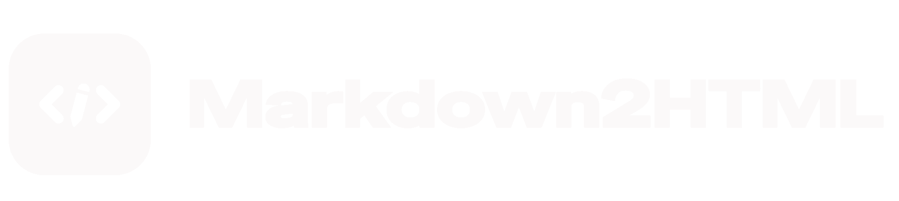
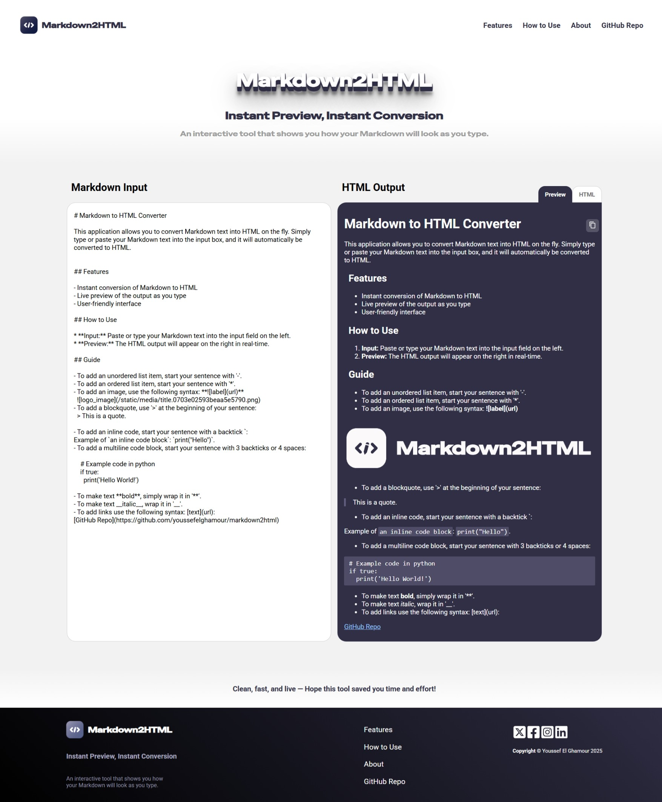
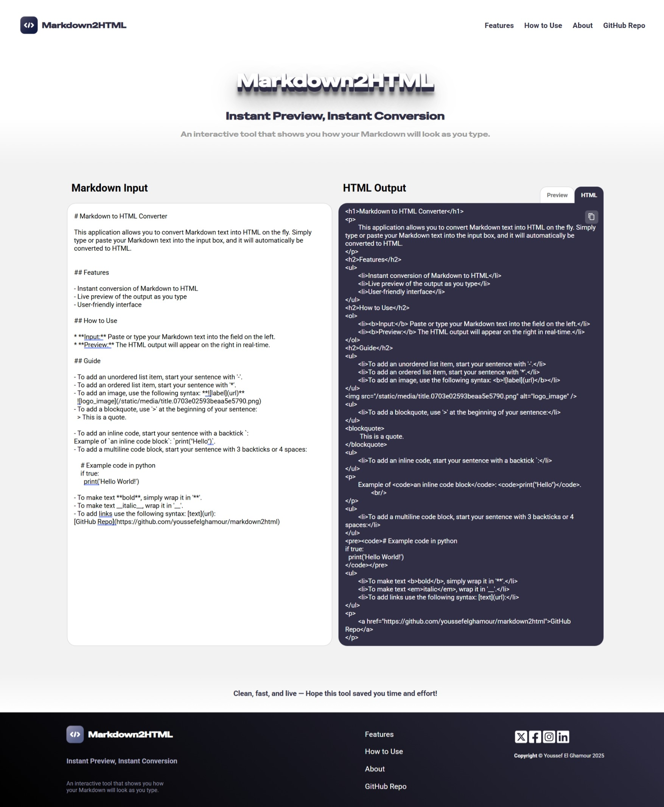

# Mardkown To HTML

A web app that converts Markdown syntax into HTML, allowing users to preview and copy the generated HTML output easily. This app provides a user-friendly interface for quickly converting Markdown syntax.

## Features

- Instant conversion of Markdown to HTML
- Live preview of the output as you type
- User-friendly interface
- Built with React for the frontend and Flask for the backend
- Styled using Aphrodite for dynamic styling and custom CSS files

## How to Use

1. **Input:** Paste or type your Markdown text into the input field on the left.
2. **Preview:** The HTML output will appear on the right side in real-time.
3. **Conversion:** The app automatically converts your Markdown into HTML as you type.

## Technologies Used

- **Frontend:** React, Aphrodite (for styling), CSS
- **Backend:** Flask (Python)
- **API:** Flask RESTful for handling the conversion requests
- **Styling:** Aphrodite (for dynamic styles) and custom CSS files

## Installation

1. Clone the repository:
    ```bash
    git clone https://github.com/youssefelghamour/markdown2html.git
    ```

### Frontend (React)

2. Navigate to the `client` folder
    ```bash
    cd client
    ```
3. Install dependencies:
   ```bash
   npm install
   ```
4. Start the development server:
    ```bash
    npm start
    ```

### Backend (Flask)

5. Navigate to the `api` folder
    ```bash
    cd api
    ```
6. Run the Flask server
    ```bash
    python app.py
    ```

## API Endpoints

### POST /convert

- Description: Converts Markdown to HTML.
- Request Body:
    ```json
    {
        "data": "## Markdown Text"
    }
    ```
- Response:
    ```json
    {
        "html": "<h2>Markdown Text</h2>"
    }
    ```

## Screenshots

#### Markdown



#### HTML



## Author

- **Youssef El Ghamour** - [GitHub](https://github.com/youssefelghamour) | [LinkedIn](https://www.linkedin.com/in/youssefelghamour/)